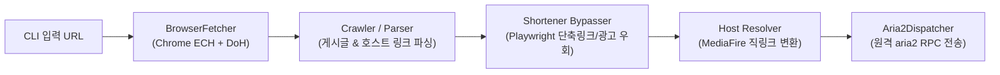

# Vesper-X

*Direct Link Extractor & Shortener Bypass Automation Suite*

**Vesper-X**는 웹 미디어 및 디지털 화보 게시글에서 단축 링크와 광고를 자동으로 우회하고, 파일 호스트(MediaFire, Gofile 등)의 무손실 원본 통압축(ZIP/RAR) 직링크를 추출하여 aria2 다운로더로 전송하는 고성능 자동화 도구입니다.

---

## 🚀 주요 기능

- **Post Parsing**: 지원 대상 웹 아카이브 게시글에서 호스트 다운로드 링크 자동 추출
- **Shortener Bypass**: 단축링크 및 광고 페이지 Playwright 기반 브라우저 자동 우회
- **Direct Link Extraction**: 파일 호스트(MediaFire 등) 직링크 자동 변환
- **Aria2 Dispatch**: aria2 RPC 데몬 연동 백그라운드 고속 전송

---

## 🏗️ 아키텍처 및 파이프라인



---

## 📦 설치

```bash
uv sync
uv run playwright install chromium   # 단축링크 자동 우회용 브라우저 설치
```

요구사항: Python 3.12+, aria2 RPC daemon (`~/.config/url-resolver/config.toml`)

---

## 💻 사용법

### 1. 단일 게시글 파싱
```bash
uv run vesper parse "https://example-archive.com/post/12345" --extract-only
```

### 2. 카테고리 / 태그 연속 크롤링
```bash
uv run vesper crawl "https://example-archive.com/category/model-name/" --pages 2
```

### 3. 클립보드 URL 즉시 처리
```bash
uv run vesper clip
```

---

## 📚 문서 및 로드맵

- [ROADMAP.md](ROADMAP.md) — 중장기 우회 고도화 및 파일호스트 확장 계획

---

## 📄 라이선스

MIT

