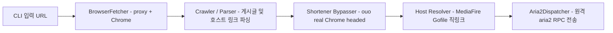
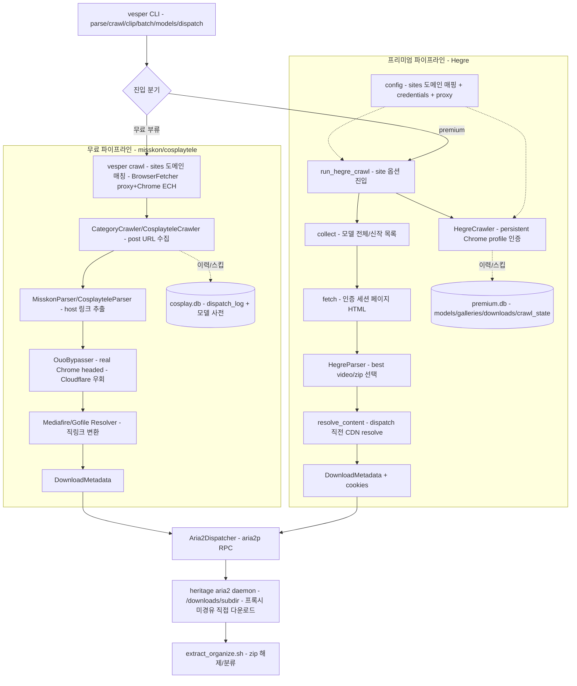

# Vesper-X

*Direct Link Extractor & Shortener Bypass Automation Suite*

**Vesper-X**는 웹 미디어 및 디지털 화보 게시글에서 단축 링크와 광고를 자동으로 우회하고, 파일 호스트(MediaFire, Gofile 등)의 무손실 원본 통압축(ZIP/RAR) 직링크를 추출하여 aria2 다운로더로 전송하는 고성능 자동화 도구입니다.

---

## 🚀 주요 기능

- **Post Parsing**: 지원 대상 웹 아카이브 게시글에서 호스트 다운로드 링크 자동 추출
- **Shortener Bypass**: 단축링크 및 광고 페이지 Playwright 기반 브라우저 자동 우회
- **Direct Link Extraction**: 파일 호스트(MediaFire, Gofile 등) 직링크 자동 변환
- **Aria2 Dispatch**: aria2 RPC 데몬 연동 백그라운드 고속 전송
- **수집/다운로드 2-Phase**: `crawl --collect`로 수집 후 `vesper dispatch`로 별도 전송 (mediafire 직전 재 resolve)
- **프리미엄 사이트 크롤러**: Hegre·W4B 인증 세션으로 프리미엄 원본(ZIP·4K mp4) 추출 (premium.db 이력 관리)
- **Model Registry**: cosplay.db 기반 모델명 통일·사이트별 보유/아카이브 현황 조회 (`vesper models`)

---

## 🏗️ 아키텍처 및 파이프라인


```mermaid
graph LR
    URL[CLI 입력 URL] --> Fetcher[BrowserFetcher - proxy + Chrome]
    Fetcher --> Parser[Crawler / Parser - 게시글 및 호스트 링크 파싱]
    Parser --> Bypasser[Shortener Bypasser - ouo real Chrome headed]
    Bypasser --> Resolver[Host Resolver - MediaFire Gofile 직링크]
    Resolver --> Dispatcher[Aria2Dispatcher - 원격 aria2 RPC 전송]
```

전체 시스템 구성도 — 무료/프리미엄 두 부류가 DB와 dispatch를 분담한다:


```mermaid
graph TD
    subgraph FREE[무료 파이프라인 - misskon/cosplaytele]
        F1[vesper crawl - sites 도메인 매칭 - BrowserFetcher proxy+Chrome ECH]
        F1 --> F2[CategoryCrawler/CosplayteleCrawler - post URL 수집]
        F2 --> F3[MisskonParser/CosplayteleParser - host 링크 추출]
        F3 --> F4[OuoBypasser - real Chrome headed - Cloudflare 우회]
        F4 --> F5[Mediafire/Gofile Resolver - 직링크 변환]
        F5 --> FM[DownloadMetadata]
        F2 -.이력/스킵.-> CDB[(cosplay.db - dispatch_log + 모델 사전)]
    end

    subgraph PREM[프리미엄 파이프라인 - Hegre]
        P1[run_hegre_crawl - site 옵션 진입]
        P1 --> P2[HegreCrawler - persistent Chrome profile 인증]
        P1 --> P3[collect - 모델 전체/신작 목록]
        P3 --> P4[fetch - 인증 세션 페이지 HTML]
        P4 --> P5[HegreParser - best video/zip 선택]
        P5 --> P6[resolve_content - dispatch 직전 CDN resolve]
        P6 --> PM[DownloadMetadata + cookies]
        P2 -.이력/스킵.-> PDB[(premium.db - models/galleries/downloads/crawl_state)]
        CFG[config - sites 도메인 매핑 + credentials + proxy]
        CFG -.-> P1
        CFG -.-> P2
    end

    CLI[vesper CLI - parse/crawl/clip/batch/models/dispatch] --> BR{진입 분기}
    BR -->|무료 부류| F1
    BR -->|premium| P1
    FM --> AR[Aria2Dispatcher - aria2p RPC]
    PM --> AR
    AR --> HD[heritage aria2 daemon - /downloads/subdir - 프록시 미경유 직접 다운로드]
    HD --> EX[extract_organize.sh - zip 해제/분류]
```

---

## 📦 설치

```bash
uv sync
uv run playwright install chromium   # gofile 캡처용 (ouo/misskon은 실제 Chrome 사용)
```

요구사항: Python 3.12+, aria2 RPC daemon (`~/.config/url-resolver/config.toml`)

---

## 💻 사용법

### 1. 단일 게시글 파싱

```bash
uv run vesper parse "https://example-archive.com/post/12345" --extract-only
```

### 2. 카테고리 / 태그 연속 크롤링

```bash
uv run vesper crawl "https://example-archive.com/category/model-name/" --pages 2
```

### 3. 클립보드 URL 즉시 처리

```bash
uv run vesper clip
```

### 4. 수집과 다운로드 분리 (2-Phase)

```bash
uv run vesper crawl "https://misskon.com/tag/<model>/" --collect   # 수집만
uv run vesper dispatch                                             # 나중에 일괄 전송
```

### 5. 프리미엄 사이트 크롤링 (Hegre·W4B)

```bash
uv run vesper crawl --site hegre --new        # 신작 (체크포인트)
uv run vesper crawl --site hegre --model ani  # 모델 전체
uv run vesper crawl --site w4b --model christy-white  # W4B 모델 전체
```

### 6. 모델 조회 (사이트 보유량 + 내 아카이브 현황)

```bash
uv run vesper models zinieq
```

---

## 📚 문서 및 안내 (Documentation & Diátaxis Index)

| 영역 (Quadrant)                       | 대상 문서 및 가이드                                                                  | 설명                                                                                                          |
| :------------------------------------ | :----------------------------------------------------------------------------------- | :------------------------------------------------------------------------------------------------------------ |
| **🚀 Tutorials (튜토리얼)**     | [📦 설치 및 시작하기](#-설치)                                                         | 패키지 동기화 및 단축링크 우회 브라우저 초기 설정                                                             |
| **🛠️ How-To Guides (가이드)** | [💻 핵심 사용법](#-사용법)                                                            | 단일 파싱, 태그별 연속 크롤링, 클립보드 즉시 처리 절차                                                        |
| **📖 Reference (참고자료)**     | [CLI 명령어 명세](#-사용법)                                                           | `vesper` CLI 서브커맨드(`parse`, `crawl`, `clip`, `batch`, `models`, `dispatch`, `sync`) 규격 |
| **💡 Explanation (설명/원리)**  | [🏗️ 아키텍처 및 파이프라인](#️-아키텍처-및-파이프라인)[🗺️ ROADMAP.md](ROADMAP.md) | 프록시/Chrome 우회 파이프라인 동작 원리 및 중장기 확장 로드맵                                                 |

---

## 📄 라이선스

MIT
