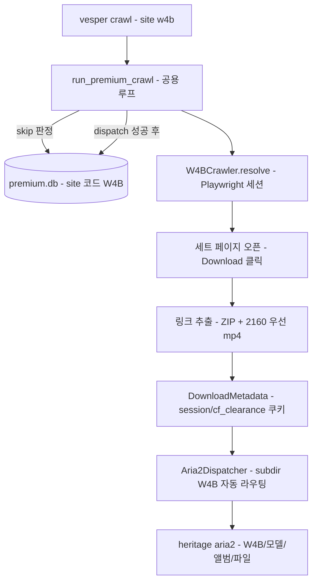

# W4B(Watch4Beauty) 다운로더 설계

작성: 2026-09-27 · 상태: 설계 승인, 구현 전

## 목차

- [1. 목표와 배경](#1-목표와-배경)
- [2. 실측 결과 Ground Truth](#2-실측-결과-ground-truth)
- [3. 설계](#3-설계)
- [4. 테스트 계획](#4-테스트-계획)
- [5. 검증 기준](#5-검증-기준)
- [6. 비목표 YAGNI](#6-비목표-yagni)
- [7. 오픈 아이템](#7-오픈-아이템)
- [8. 보안](#8-보안)

## 1. 목표와 배경

- **목표**: 유료 구독 사이트 Watch4Beauty(watch4beauty.com, 이하 W4B)의 세트 자산(사진 ZIP + 4K 영상 mp4)을 기존 Hegre 프리미엄 파이프라인과 동일한 방식으로 수집·aria2 dispatch 한다.
- **성공 기준**:
  - `uv run vesper crawl --site w4b --model christy-white --extract-only` 가 세트별 ZIP+mp4 메타데이터를 출력한다
  - dispatch 시 `premium.db`에 site 코드 `W4B`로 이력이 기록되고, 재크롤에서 skip 한다
  - `uv run pytest` 통과
- **배경**: `premium_db.py`는 설계 단계부터 H/W4B 부류 분담을 예고했다(`site` 컬럼). Hegre 패턴 — persistent Chrome profile 인증, dispatch 직전 CDN resolve, premium.db 단일 이력 소스 — 을 미러링하되, W4B의 구조적 차이 한 건(다운로드 링크가 JS가 채움 → Playwright 상호작용 resolve)만 반영한다.
- **크롤 루프 일반화**: W4B 추가를 계기로 `run_hegre_crawl`을 `run_premium_crawl`로 일반화한다. 복제 방식은 3번째 프리미엄 사이트 추가 시 로직 3벌 유지 문제를 만들므로 선택하지 않았다.

## 2. 실측 결과 Ground Truth

2026-09-27 real Chrome + 유료 계정 실측. 이 스펙의 URL·selector는 모두 아래 실측에 근거한다.

| 항목 | 실측 |
| :--- | :--- |
| 접근 | 한국 직접 접속 가능. Cloudflare 존재(`cf_clearance` 자동 발급, real Chrome 통과) |
| 로그인 | `GET /login` — form(action=`/`, method=post), `#username-field` / `#password-field` / submit `button.button`. 성공 시 `/updates` redirect. `page.click()` 이 무시되는 경우가 있어 `requestSubmit()` fallback 확인 |
| 세션 쿠키 | `session`(Express). 부수 쿠키: `w4b_age_visitor_id`(성인 게이트), `cf_clearance`(Cloudflare) |
| 정본 URL | 모든 다운로드 가능 세트는 **`/updates/<slug>`** 단일 계열. `/films`, `/galleries`는 같은 issue의 필터 목록. `/stories/<slug>`는 에디토리얼로 다운로드 없음 → 수집 제외 |
| 모델 페이지 | `/models/<slug>` — 콘텐츠 링크는 `a.grid-item`(updates + stories 혼재). h1에 모델명. 페이지네이션 없음(6건 실측) |
| 세트 페이지 | h1 앨범 제목, 부제(`71 PHOTOS & VIDEO` / `17:55 FILM`), 발행일(`2022.3.4`), `STARRING` 링크(`a[href*='/models/']`)에 모델명 |
| 다운로드 링크 | **툴바 Download 클릭 후 JS가 DOM에 채움** — 초기 HTML에 없음. ZIP: `a.button[href*='.zip']` → `/api/media/<yyyymmdd>-max.zip`(상대경로, 토큰 없음). 영상: `Download 4K` → `/api/media/download/issues/<ym>/<slug>/{video\|backstage}/2160.mp4?ttl&token`, fallback `1080.mp4` |
| 세트 변동성 | 사진+영상 겸용 / 영상 전용(ZIP 없음). 사진 전용 존재 가능 — 링크 존재 여부로 판정 |
| 미디어 CDN | 302 도착지: `photo-members` / `video-members.watch4beauty.com`, `covers.watch4beauty.com`, 일부 `*.mjedge.net` — 서명 `ttl`+`token` |
| updates 목록 | 페이지네이션 링크 없음, scroll 시 DOM 감소(15→12, 가상화 추정) — 미확정 |

## 3. 설계



### 3.1 크롤러 인터페이스 통일

모든 프리미엄 crawler가 같은 공용 메서드를 갖는다:

```python
resolve(url: str) -> list[DownloadMetadata]   # fetch + 추출 포함
collect(model_slug: str | None = None) -> list[dict]   # [{url, title}]
login() -> bool
```

- `HegreCrawler.resolve(url)`: 기존 `fetch(url)` + `resolve_content(html, url)`를 감싸는 얇은 래퍼 **1개 추가**. 기존 메서드는 무변경.
- `W4BCrawler.resolve(url)`: Playwright 세션 안에서 세트 페이지 오픈 → Download 클릭 → `a.button[href*='.zip'], a.button[href*='.mp4']` 대기·추출 → metadata 생성까지 수행. (링크가 클릭 후 채워지므로 Hegre처럼 fetch/parse 2단계로 나눌 수 없다)

### 3.2 cli.py — run_premium_crawl 일반화

`run_hegre_crawl`을 `run_premium_crawl(site, url, model, new_only, extract_only, limit, ...)`으로 일반화한다. 루프 본체(`db.is_downloaded` skip → `crawler.resolve` → dispatch → premium.db 기록 → checkpoint)는 사이트 무관.

site마다 달라지는 것은 매핑 테이블 값 3개뿐이다:

| site | crawler | site 코드 | creds 키 |
| :--- | :--- | :--- | :--- |
| hegre | `HegreCrawler` | `"H"` | `credentials.hegre` |
| w4b | `W4BCrawler` | `"W4B"` | `credentials.w4b` |

- `crawl` 커맨드: `--site w4b` 허용 + URL hostname 분기(`watch4beauty.com`, `_is_hegre_url`과 동일한 hostname 기준).
- `models` 커맨드: premium 보유 출력에 site 컬럼 표시 — `PremiumDB.holding_by_model` SELECT에 `m.site` 추가(소폭 변경).

### 3.3 extractors/w4b.py 신설

hegre.py 미러 구조. 상수는 실측값으로 격리한다:

```python
URLS = {
    "home": "https://www.watch4beauty.com",
    "login": "https://www.watch4beauty.com/login",
    "model": "https://www.watch4beauty.com/models/{slug}",
    "updates": "https://www.watch4beauty.com/updates",
}
SELECTORS = {
    "login_user": "#username-field",
    "login_pass": "#password-field",
    "model_content_links": "a.grid-item",
    "download_links": "a.button[href*='.zip'], a.button[href*='.mp4']",
}
```

- **collect**:
  - 모델 모드: `/models/<slug>`의 `a.grid-item` href 중 `/updates/<slug>` fullmatch만 수집 — stories 제외, "THERE'S MORE" 추천 노이즈는 모델 페이지에 없어 scoping 불필요(세트 페이지의 추천 섹션은 목록 수집 대상이 아니다)
  - 신작 모드: `/updates` 오픈 + scroll 루프 → `/updates/<slug>` 링크(`/updates/popular` 등 비세트 경로 제외). 페이지네이션은 오픈 아이템 7.1
- **resolve** (Playwright 상호작용):
  - Download 트리거 클릭 → 다운로드 패널 렌더 대기
  - ZIP 0~1개(영상 전용 세트엔 없음), mp4는 `2160` 우선 → `1080` fallback, 둘 다 없으면 빈 목록(1건 실패가 전체를 중단하지 않는다)
  - 선택 로직은 순수 함수 `W4BParser.pick_downloads(links: list[dict]) -> list[dict]` 로 분리 — Playwright 없이 테스트 가능
  - ZIP은 상대경로이므로 `urljoin` 필수. mp4 서명 URL은 TTL이 있으므로 **dispatch 직전 resolve** 원칙 유지(Hegre 4.3과 동일)
- **filename** (Hegre 4.1 계층과 동일): `{모델명}/{앨범 제목}/{basename}` — 예: `Christy White/Quickie By The Pool/20220304-max.zip`
  - basename은 사이트 원본 그대로: zip `20220304-max.zip`, mp4 `2160.mp4` — 앨범 디렉토리가 구분자 역할을 하므로 이름 변환을 하지 않는다(KISS)
  - 모델명은 세트 페이지 `STARRING` 링크 텍스트를 그대로 사용한다(대소문자 변환 없음 — heritage 분류 단계의 관심사로 위임)
- **인증/세션**: `launch_persistent_context`, profile `~/.config/url-resolver/w4b_profile`, `channel="chrome"`, `headless=False`, proxy 적용 — ouo/Hegre와 동일 패턴
  - 로그인: fill → submit click → URL이 `/login`을 벗어나는지 확인, 실패 시 `requestSubmit()` fallback(실측: click 무시 사례 있음)
  - 성인 게이트: `w4b_age_visitor_id` 쿠키는 첫 방문에서 자동 발급되었고 persistent profile이 유지한다 — 별도 처리 없음
- **쿠키 stash**: `session` + `cf_clearance`를 모아 `DownloadMetadata.cookies`에 `Cookie` 헤더 형식(`name=value; name=value`)으로 전달. `user_agent`는 브라우저 세션의 실제 UA — `cf_clearance`는 UA·IP 바인딩이 있어 헤더 불일치 시 무효화된다. Cloudflare가 aria2 직접 요청을 챌린지하지 않으면 `cf_clearance`는 무해한 잉여다(오픈 아이템 7.3)

### 3.4 설정·라우팅·DB

- `config/default.toml`: `"watch4beauty.com" = { crawler = "w4b", subdir = "W4B" }` — `_site_subdir`가 source_page 호스트로 자동 라우팅하므로 aria2는 `W4B/` 하위로 전송한다
- `[credentials.w4b]`는 로컬 `~/.config/url-resolver/config.toml`에만 둔다(repo 평문 금지)
- `premium_db.py` 스키마 무변경 — site 문자열 `"W4B"`가 새 값으로 기록될 뿐이다. checkpoint도 동일하게 `crawl_state`의 site 키로 쓴다

## 4. 테스트 계획

전통패 — 실 network 없이 mock/fixture 기반(test_hegre.py 패턴):

- `tests/test_w4b.py`:
  - `pick_downloads`: 2160 우선 / 1080 fallback / ZIP 부재(영상 전용) / mp4 부재(사진 전용) / 둘 다 부재(빈 목록) / 상대경로 urljoin
  - `extract_model_content_refs` 상당: grid-item에서 `/updates/<slug>`만 남기고 stories 제외
  - filename 계층(`모델/앨범/파일`)
- `tests/test_cli.py` (기존 hegre 테스트 확장):
  - `run_premium_crawl` site 파라미터화 — site 코드별 premium.db 기록, skip 판정, creds 키 조회
  - 기존 hegre 경로 회귀 없음 확인

## 5. 검증 기준

1. 단위 테스트 → verify: `uv run pytest` 통과
2. 수집 E2E(실접속 — 실행 시 승인) → verify: `uv run vesper crawl --site w4b --model christy-white --extract-only` 가 6세트 기준 ZIP/mp4 메타데이터 출력(영상 전용 세트는 mp4만)
3. dispatch E2E → verify: heritage `W4B/` 디렉토리에 파일 도착 + premium.db `downloads` 기록
4. 재크롤 → verify: 동일 모델 재실행 시 전 행 skip

## 6. 비목표 YAGNI

- `/stories/<slug>`(에디토리얼) 수집
- 1080 mp4 정기 수집 — 4K 부재 시 fallback으로만
- 개별 이미지 다운로드 — ZIP이 있으면 ZIP만
- 무료 공개분(비회원) 크롤
- 3번째 프리미엄 사이트 추상화 — 매핑 테이블만으로 충분, 그 이상의 프레임워크화 금지

## 7. 오픈 아이템

1. updates 무한스크롤/페이지네이션 — 구현 첫 E2E에서 동작 확정. 신작 모드는 1페이지+scroll N회로 시작
2. Download 트리거 selector — role/name 기반(`link "Download"`)으로 시작, 구현에서 확정 후 상수화
3. aria2 요청에 `cf_clearance` 필요 여부 — 403/challenge 응답 시에만 손본다

## 8. 보안

- `[credentials.w4b]`는 로컬 `~/.config/url-resolver/config.toml`에만 존재한다. repo에는 키 이름만 언급
- repo의 `account.txt`(평문 credentials)는 로컬 config 이관 후 폐기 권장. 이 문서에 실제 credentials를 기재하지 않는다
